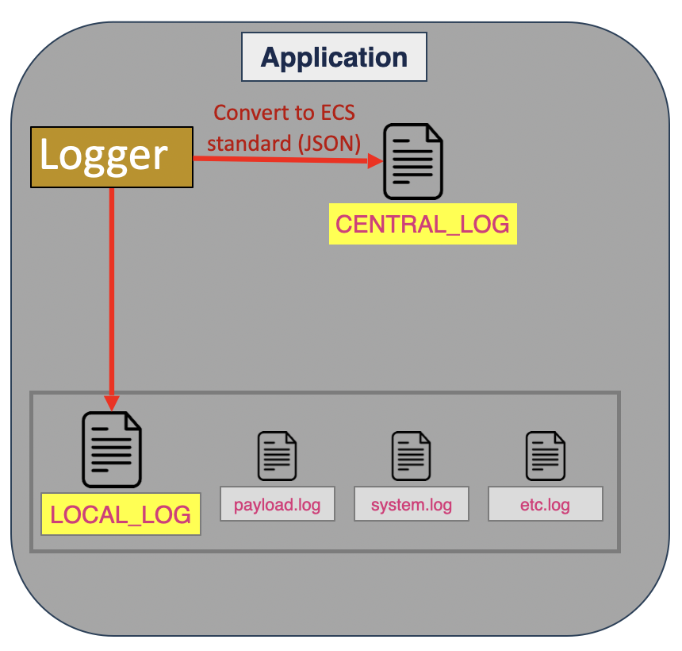
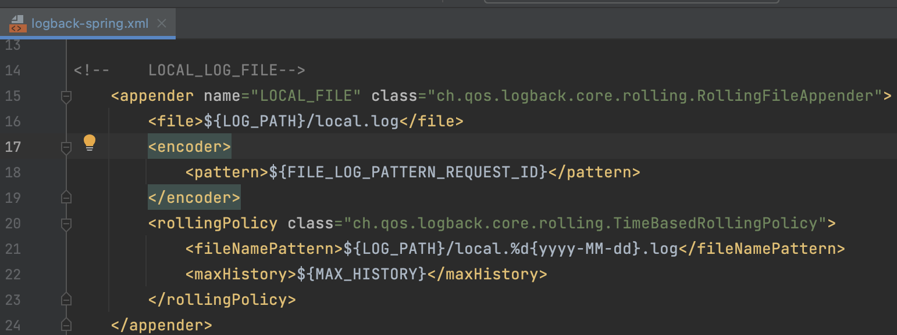

## Introduction
As the person responsible for overseeing the observability solution for wealth products, my role involves customizing various functionalities to align with our business needs, even though we've acquired a software package from a vendor. One key area requiring substantial development is logging. We are tasked with building logging mechanisms from the ground up, engaging in discussions with the vendor to establish mutual agreement on aspects such as logging data fields, logging format, and logging correlation. 

Having dedicated time to research and discover effective logging solutions, I aim to document and share the insights gained through this blog for the benefit of others.

## Challenges in Logging Design 
Once I deal with the logging design for shipping the log from the local application to the ELK stack, There are many questions that pop into my head, such as
* How can we know what the data is that we should or shouldn't push to ELK ?
* Do we need to log the payload and ship it to ELK ?
* Then, how will we handle confidential data ?\
etc.

## First step into the logging design
I thought a lot about where to start, and I began with a simple question: "Which logs from our apps should go to ELK?" This is a big deal because it might not a good idea to send everything to ELK. Especially in my situation, ELK is like a shared tool for everyone in the organization.

To answer this question, we need to think over back about who will use these logs and how they'll use them. It's not only about what information to log but also about making sure the logs are useful for the people who will be using them.

For example, in my case, there are 3 teams that's going to consume the logging from ELK, and 3 of them use logging for analyzing the difference objective as shown below.

| Team            | Focus                                      | Objective                                               |
|-----------------|--------------------------------------------|---------------------------------------------------------|
| Capacity Team   | Track the quantity of transactions          | Using logging to estimate transaction growth and capacity planning  |
| Warroom Team    | Monitor transaction duration               | Alerting when the duration of transactions spikes        |
| Application Team| Identify error transactions                 | Investigating transaction outcomes, events, and associated errors |

So far, I know who my customers are and what they want. Therefore, to answer the question, "Which logs from our apps should go to ELK?" It's easier now; we can select the data fields to log and ship it to ELK for meeting objective of three team.

## Multiple log
Until now, I made some drafts of the data logging fields we'll send to ELK. Now, we'll concentrate on coding our program to handle logging. Even though we have specific data fields for ELK, we also need to set up the program to keep logs locally.\
Local logs store all the detailed information about how the application behaves, which is super important for investigating issues when they happen.

  

The illustration above explains that there are 2 types of logs:\
`1.CENTRAL_LOG:` This log is sent to ELK, and we need to use the ECS standard and the ECS logging library to automatically convert the log into JSON format.\
`2.LOCAL_LOG:` This log is kept locally and contains all the behavior of our application.

Since LOCAL_LOG contains all logs related to our application, it might be challenging to investigate if all logs are kept in a single file. Therefore, it is practical to separate logs into multiple files based on their content. The way to separate log files depends on the design or requirements.

In my case, I separated payload logs from system logs. This is helpful because, in case of transmission errors, like a user entering data in an incorrect format, we can focus on investigating payload.log.

On the other hand, if our application encounters a major issue, such as being unable to start or the service being down, we can investigate from system.log.

## Configuration multiple log 

  

To set up multiple log files, I employed the following 2 approaches:

`1. Logback Configuration:` Utilized Logback to manage multiple log files with the following settings in the logback.xml file:
* Loggers: Configured two loggers, one for CENTRAL_LOG and another for LOCAL_LOG.
* Log Level: Set log level to INFO, capturing all logs.
* Rolling Policy: Implemented a rolling policy to archive logs based on date.
* AsyncAppender: Employed an AsyncAppender for asynchronous log processing.

`2. Logging Aspect with Spring AOP:` Applied the concept of Aspect-Oriented Programming (AOP) in Spring for capturing logs related to CENTRAL_LOG and LOCAL_LOG.
* ECSLoggingAspect: Captured logs from services and structured them according to the ECS standard, incorporating custom fields.
* PayloadLoggingAspect: Captured payload information from request and response.
